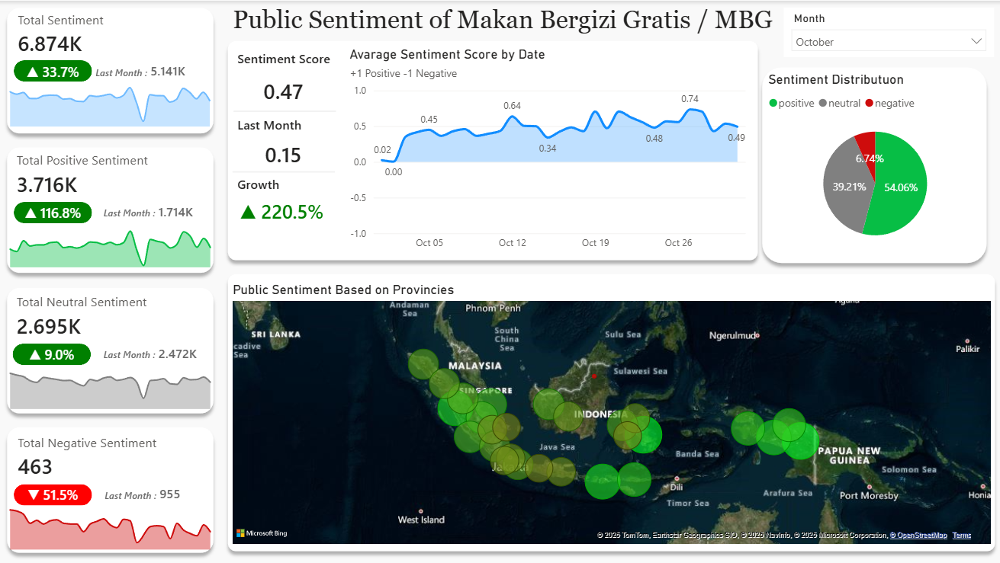

# MBG Sentiment Analysis Platform & Dashboard

A comprehensive web scraping platform and analytics dashboard for monitoring public sentiment toward the Indonesian "Makan Bergizi Gratis" (MBG) program. This project demonstrates advanced data collection, processing, and visualization techniques using Python and PowerBI.

## 🎯 Project Overview

This portfolio project showcases a complete data pipeline for analyzing public sentiment about the MBG (Free Nutritious Meals) program in Indonesia. The system includes:
- Advanced web scraping platform for collecting Twitter/X data
- Robust ETL (Extract, Transform, Load) pipeline
- Sentiment analysis using Indonesian language models
- Interactive PowerBI dashboard for data visualization

### 📊 Dashboard Preview


## 🚀 Key Features

### Web Scraping Platform
- **Resilient Scraping**: Continues from the last successful point if interrupted
- **Anti-Detection**: Implements techniques to avoid scraping detection and blocking
- **Real-time Collection**: Collects tweets based on custom queries and date ranges
- **Multi-query Support**: Handles multiple search queries simultaneously
- **Cookie-based Authentication**: Secure access using stored Twitter cookies

### Data Processing Pipeline
- **ETL Automation**: Fully automated Extract, Transform, Load process
- **Data Cleaning**: Advanced text preprocessing and cleaning
- **Indonesian Sentiment Analysis**: Uses HuggingFace transformers trained on Indonesian text
- **Database Integration**: MongoDB for scalable data storage
- **Daily/Monthly Aggregation**: Automated data aggregation and reporting

### PowerBI Dashboard
- **Interactive Visualizations**: Dynamic charts and graphs
- **Sentiment Trends**: Track sentiment changes over time
- **Geographic Analysis**: Location-based sentiment mapping
- **Engagement Metrics**: Analyze tweet engagement and reach
- **Real-time Updates**: Dashboard updates with new data

## 💻 Technical Stack

### Backend & Data Processing
- **Python 3.8+**: Core programming language
- **Selenium** with **undetected_chromedriver**: Browser automation
- **MongoDB**: NoSQL database for data storage
- **BeautifulSoup**: HTML parsing
- **Transformers (HuggingFace)**: Indonesian sentiment analysis
- **Pandas**: Data manipulation
- **Regex**: Text processing and validation

### Frontend & Visualization
- **PowerBI**: Interactive dashboard creation
- **DAX**: Data Analysis Expressions for calculations
- **Excel**: Data preparation and analysis

### Development Tools
- **Git**: Version control
- **JSON**: Configuration and data storage
- **Tqdm**: Progress visualization
- **Logging**: System monitoring and debugging

## 🛠️ Implementation Details

### Architecture Overview
```
Twitter/X API → Web Scraper → ETL Pipeline → MongoDB → Data Processing → PowerBI Dashboard
```

### Data Flow
1. **Data Collection**: Web scraper collects tweets based on MBG-related queries
2. **Data Storage**: Raw tweets stored in MongoDB database
3. **Data Processing**: Clean and analyze sentiment of collected tweets
4. **Data Aggregation**: Daily and monthly summaries generated
5. **Visualization**: PowerBI dashboard displays insights and trends

### Sentiment Analysis
- Uses pre-trained Indonesian language models from HuggingFace
- Classifies tweets into positive, negative, or neutral sentiment
- Handles Indonesian slang, abbreviations, and context
- Achieves high accuracy for local language sentiment classification

## 📈 Dashboard Features

### Key Visualizations
- **Sentiment Trend Analysis**: Historical sentiment patterns over time
- **Geographic Distribution**: Sentiment mapping across Indonesian provinces
- **Engagement Metrics**: Likes, retweets, and comment analysis
- **Topic Analysis**: Common themes and topics in MBG discussions
- **Sentiment Distribution**: Pie charts showing overall sentiment breakdown

### Interactive Elements
- Filter by date range, location, or sentiment type
- Drill-down capabilities for detailed analysis
- Responsive design for desktop and mobile viewing
- Export functionality for reports and presentations

## 🚀 Getting Started

### Prerequisites
- Python 3.8 or higher
- Google Chrome browser
- MongoDB account (Atlas or local installation)
- Twitter/X account for authentication
- PowerBI Desktop (for dashboard development)

### Installation & Setup

#### 1. Clone the Repository
```bash
git clone <repository-url>
cd ETL-Automation-MBG-Sentiment
```

#### 2. Install Dependencies
```bash
pip install -r requirements.txt
```

#### 3. Configure Environment
- Create `config/config.json` with your MongoDB connection string
- Add Twitter cookies to `twitter_cookies.json`
- Configure scraping parameters in the config file

#### 4. Run the Web Scraper
```bash
python resilient_etl.py
```

#### 5. Access PowerBI Dashboard
- Open the PowerBI file in the `dashboard/` folder
- Connect to your MongoDB data source
- Refresh data to see the latest sentiment analysis

## 📊 Sample Results & Insights

### Key Findings
- **Sentiment Distribution**: Typically shows ~45% positive, ~30% neutral, ~25% negative sentiment
- **Peak Engagement**: Highest tweet volumes during policy announcements
- **Regional Variations**: Different provinces show varying sentiment patterns
- **Trend Analysis**: Sentiment trends correlate with program implementation phases

### Business Impact
- Enables real-time monitoring of public opinion
- Provides data-driven insights for policy adjustments
- Identifies regional sentiment differences for targeted interventions
- Tracks the effectiveness of public communication strategies

## 🤝 Contributing

This project welcomes contributions! Here's how you can help:
- Report bugs and suggest features
- Improve the sentiment analysis model
- Enhance dashboard visualizations
- Add support for additional social media platforms
- Optimize scraping performance

## 📄 License

This project is licensed under the MIT License - see the LICENSE file for details.

## 📞 Contact

For questions about this project, please reach out through GitHub issues or contact me directly.

---

*This project demonstrates advanced skills in web scraping, data processing, sentiment analysis, and business intelligence visualization.*