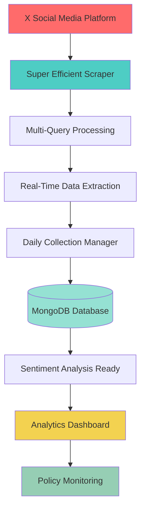

# ETL Automation - Web Scraper for MBG Sentiment Analysis with Dashboard Analytics

<p align="center">
  
  
  
  
</p>

<p align="center">
  <strong>Advanced Web Scraper & ETL System for Indonesian Government Program Sentiment Analysis with Analytics Dashboard</strong>
</p>

<p align="center">
  <em>Advanced ETL Automation for scraping and analyzing public sentiment towards Free Nutritious Meals (MBG) Program on social media platforms with PowerBI Dashboard Analytics</em>
</p>

---

## 🎯 Project Overview

**ETL-Automation-MBG-Sentiment** is a sophisticated **Web Scraper** and **ETL (Extract, Transform, Load)** system designed to collect, process, and analyze public opinions related to Indonesia's **Free Nutritious Meals (Makanan Bergizi Gratis - MBG)** government program on social media platforms, particularly X (formerly Twitter). System dilengkapi dengan **Dashboard Analytics** untuk visualisasi data sentimen.

This project implements advanced **web scraping techniques** using **Selenium** and **Beautiful Soup**, combined with efficient **MongoDB** storage systems to enable comprehensive **Sentiment Analysis** for government policy monitoring, with integrated **PowerBI dashboard** for real-time analytics.

---

## 🚀 Key Features

| Feature | Description |
|---------|-------------|
| **Maximum Tweet Extraction** | Implements 5 different query approaches to capture maximum tweets per day |
| **Multi-Query Strategy** | Advanced search techniques to maximize data collection coverage |
| **Real-Time Collection** | Continuous scraping with intelligent pause management |
| **Daily Organization** | Automatic data separation by collection date into separate MongoDB collections |
| **Location Detection** | Automatic detection of Indonesian locations from tweet content using comprehensive database |
| **Duplicate Prevention** | Dual-filter system to prevent duplicate content storage |
| **Rate Limit Handling** | Intelligent anti-detection mechanisms to avoid platform restrictions |
| **Efficient Processing** | High-speed data extraction and transformation |
| **Analytics Dashboard** | Integrated PowerBI dashboard for sentiment visualization and reporting |

---

## 🏗️ Architecture Overview



### Core Components:

- **Super Efficient Scraper**: Advanced web scraping engine with multi-query capabilities
- **Daily Collection Manager**: Automated MongoDB collection system based on dates  
- **Location Intelligence**: Comprehensive Indonesian location database detection
- **Anti-Detection System**: Smart rate limiting bypass mechanisms
- **Analytics Dashboard**: PowerBI integration for sentiment visualization

---

## 📁 Project Structure

```
ETL-Automation-MBG-Sentiment/
├── config/                      # Configuration directory
│   ├── config.json              # Main application configuration
│   ├── cookies.json             # Session cookies (manual input required)
│   └── indonesia_locations.json # Indonesian locations database
├── data/                        # ETL results data storage
├── Dashboard/                   # Analytics dashboard files (PowerBI, Tableau, etc.)
│   ├── mbg_sentiment_dashboard.pbix # PowerBI dashboard template
│   ├── data_export_for_powerbi.json # Exported data ready for PowerBI
│   └── visualization_specs.md   # Dashboard specifications
├── logs/                        # Application log files
├── src/                         # Main source code
│   └── super_efficient_scraper.py # Maximum efficiency scraper module
├── utils.py                     # Collection management utilities
├── max_tweets_etl.py            # Main ETL execution file
├── requirements.txt             # Python dependencies
└── README.md                    # Documentation
```

---

## 🛠️ Technologies & Libraries

### Core Technologies:
- **Python 3.9+** - Main programming language
- **Selenium 4.15.0** - Browser automation for dynamic content
- **Beautiful Soup 4** - HTML parsing and content extraction
- **MongoDB** - NoSQL database for flexible data storage
- **Undetected ChromeDriver** - Stealth browser automation
- **PowerBI** - Analytics and visualization dashboard

### Additional Libraries:
- **Requests** - HTTP requests handling
- **PyMongo** - MongoDB Python driver
- **dateutil** - Date parsing and manipulation
- **undetected-chromedriver** - Anti-bot detection evasion

---

## 📋 Installation Guide

### Prerequisites
- Python 3.9 or higher
- MongoDB Community Server
- Chrome or Chromium browser
- PowerBI Desktop (optional, for dashboard visualization)

### Setup Instructions

1. **Clone the Repository**
   ```bash
   git clone https://github.com/username/ETL-Automation-MBG-Sentiment.git
   cd ETL-Automation-MBG-Sentiment
   ```

2. **Create Virtual Environment** (Recommended)
   ```bash
   python -m venv venv
   ```

3. **Activate Virtual Environment**
   - **Windows:**
     ```bash
     venv\Scripts\activate
     ```
   - **macOS/Linux:**
     ```bash
     source venv/bin/activate
     ```

4. **Install Dependencies**
   ```bash
   pip install -r requirements.txt
   ```

5. **Start MongoDB Service**
   Ensure MongoDB is running on your system

---

## ⚙️ Configuration

### 1. Session Cookies Setup
Create `config/cookies.json` with valid Twitter/X session cookies:
```json
[
  {"name": "auth_token", "value": "your_auth_token", "domain": ".x.com", "path": "/"},
  {"name": "ct0", "value": "your_ct0_token", "domain": ".x.com", "path": "/"},
  {"name": "guest_id", "value": "your_guest_id", "domain": ".x.com", "path": "/"}
]
```

> **Note**: Cookies can be extracted using browser extensions like "EditThisCookie" when logged into X.com

### 2. Main Configuration
Adjust settings in `config/config.json`:
```json
{
  "twitter": {
    "query_1": "Makan Bergizi Gratis OR MBG lang:id",
    "query_2": "sehat OR gizi lang:id",
    "query_3": "program bantuan OR sosial lang:id",
    "query_4": "kesehatan masyarakat OR nutrisi lang:id",
    "query_5": "pemerintah OR kebijakan OR kesejahteraan lang:id",
    "days_back": 7,
    "max_tweets": 5000
  },
  "database": {
    "mongo_uri": "mongodb://localhost:27017/",
    "db_name": "mbg_sentiment_db",
    "collection_prefix": "tweets_"
  }
}
```

---

## ▶️ Usage

### Running the ETL Process
Execute the maximum tweet collection system:

```bash
python max_tweets_etl.py
```

### Expected Output
The system will:
1. Collect tweets from the last 7 days
2. Store data in daily collections (e.g., `tweets_20251201`)
3. Perform location detection and duplicate prevention
4. Generate detailed logs in the `logs/` directory
5. Export processed data to `Dashboard/` for analytics

### Dashboard Integration
After ETL completion:
1. Navigate to the `Dashboard/` folder
2. Open `mbg_sentiment_dashboard.pbix` in PowerBI Desktop
3. Connect to the exported data files
4. Customize and deploy the dashboard as needed

---

## 🔐 Security Considerations

- **Sensitive Files**: `cookies.json` contains sensitive session information and should never be committed to version control
- **Environment Variables**: Use `.env` file for additional sensitive configuration
- **Account Safety**: Use burner accounts for scraping activities
- **Rate Limiting**: Built-in intelligent delay systems to prevent account suspension

---

## 📊 Data Structure & Output

### MongoDB Collections Format
Each day creates a separate collection named `tweets_YYYYMMDD`:
```json
{
  "_id": "tweet_unique_id",
  "content": {
    "text": "original_tweet_text",
    "clean_text": "processed_for_analysis"
  },
  "metadata": {
    "author_name": "username",
    "author_handle": "@handle",
    "created_at": "ISO_date_time",
    "location": "detected_location",
    "tweet_url": "https://x.com/..."
  },
  "metrics": {
    "reply_count": 0,
    "retweet_count": 0,
    "like_count": 0
  }
}
```

### Dashboard Integration Format
Data exported to `Dashboard/` in formats compatible with PowerBI for visual analytics.

---

## 🌟 Why Choose This Solution?

| Aspect | This Solution | Other Methods |
|--------|---------------|---------------|
| **Efficiency** | Multi-query approach, maximum tweet capture | Single query method |
| **Accuracy** | Dual location detection, low duplication | Basic keyword search |
| **Scalability** | Daily collection management | Single collection storage |
| **Resilience** | Anti-detection, rate limit handling | Easy detection/blocks |
| **Analytics** | Integrated PowerBI dashboard | No visualization tools |
| **Maintenance** | Automated, intelligent | Manual intensive |

---

## 📈 Impact & Benefits

### For Government Agencies
- **Real-time Policy Monitoring**: Track public sentiment on MBG program
- **Data-Driven Decisions**: Evidence-based policy adjustments
- **Geographic Analysis**: Region-specific feedback insights
- **Visual Analytics**: PowerBI dashboards for quick insights

### For Data Scientists
- **Clean Dataset**: Pre-processed, structured tweet data
- **Rich Metadata**: Comprehensive contextual information
- **Easy Analysis**: Ready-for-analysis format
- **Dashboard Templates**: Ready-to-use PowerBI templates

---

## 📊 Dashboard Features

The `Dashboard/` folder includes:

- **PowerBI Template**: Ready-to-use PowerBI dashboard template (`mbg_sentiment_dashboard.pbix`)
- **Export Formats**: Structured data exports ready for visualization
- **Specification docs**: Detailed instructions for dashboard customization
- **Sample Visualizations**: Pre-configured charts for sentiment analysis:
  - Sentiment trends over time
  - Geographic sentiment mapping
  - Top keywords and hashtags
  - Engagement metrics
  - Location-based analysis

---

## 🔐 Security & Privacy

### .gitignore Protection
The project includes a comprehensive `.gitignore` file that ensures:
- **Session cookies** (`config/cookies.json`) are never committed
- **Environment variables** (`.env`) remain local
- **Database credentials** stay secure
- **Private keys** and certificates are protected
- **Log files** and temporary data don't clutter the repository

### Security Best Practices
- Never commit sensitive files to version control
- Use burner accounts for scraping activities
- Regularly rotate session cookies
- Keep MongoDB authentication credentials secure

## 🤝 Contributing

We welcome contributions! Feel free to:
- 🐛 Report bugs
- 💡 Suggest features
- 🔧 Submit pull requests
- 📖 Improve documentation

---

## 📄 License

This project is licensed under the MIT License - see the [LICENSE](LICENSE) file for details.

---

## 👨‍💻 Author

Built for Indonesian government program analysis and public sentiment monitoring with integrated analytics dashboard.

---

<span align="center">

**Ready to collect maximum tweets for MBG program analysis with analytics dashboard?**

⭐ Star this repository if it helps your project!

</span>